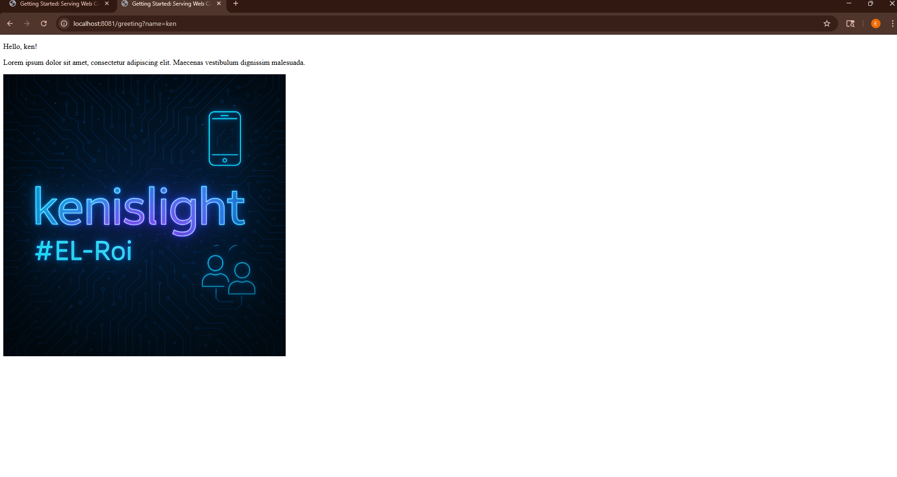

# First Project - Java Spring Boot

This is a simple Java Spring Boot application built as an introduction to web development using the Spring framework. The project includes a basic REST controller and a static HTML template to demonstrate how to build and serve dynamic and static content.

## 🚀 Getting Started

1. Run the application
2. Open your browser at: 
   `http://localhost:8080/greeting?name=ken

## Technologies Used

- **Java 21+**
- **Spring Boot**
- **Spring Web**
- **Thymeleaf** (template engine for HTML)
- **Maven** (build tool)
- **IntelliJ IDEA** (development environment)
- **Git & GitHub** (version control and hosting)`

## Screenshot of Result

