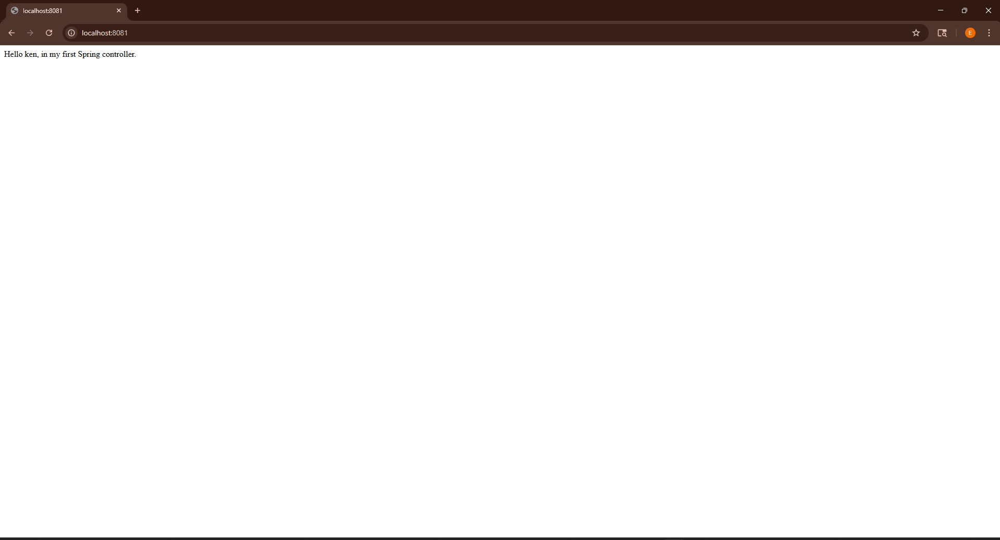

# First Project - Java Spring Boot

This is a simple Java Spring Boot application built as an introduction to web development using the Spring framework. The project includes a basic REST controller and a static HTML template to demonstrate how to build and serve dynamic and static content.


## 🚀 Getting Started

### Prerequisites
- Java 17+ installed
- Maven installed
- Git installed

1. Clone the repository:
   ```bash
   git clone https://github.com/your-username/first-project-java-spring.git
   cd first-project-java-spring

2. Run the project using Maven:
   ./mvnw spring-boot:run

3. Open your browser and go to:
http://localhost:8081/gretting




